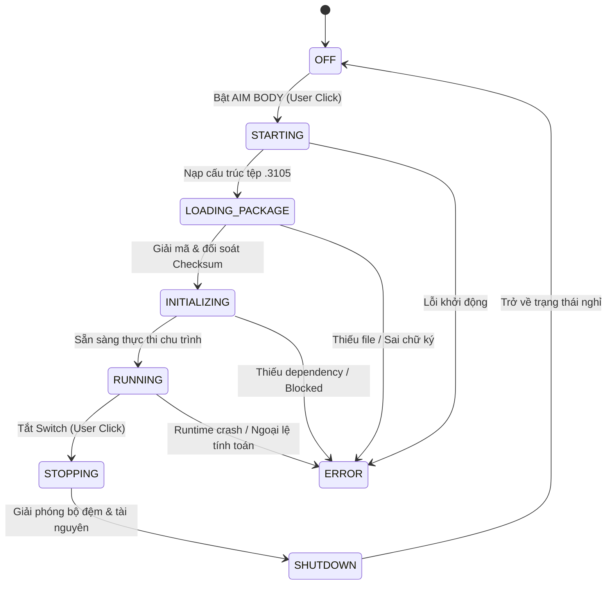

# ĐẶC TẢ CHU TRÌNH THỰC THI THỰC TẾ AIMBODY (SECTION 20 EXECUTION PIPELINE)

Tài liệu này quy định kiến trúc thực thi và chu trình can thiệp thời gian thực của module **AIM BODY** trong ứng dụng **Thanox VIP**, tuân thủ nghiêm ngặt các quy định tại **Mục 20: AIMBODY MUST ACTUALLY RUN WHEN ENABLED**.

---

## 1. NGUYÊN TẮC CỐT LÕI (20.1 REAL EXECUTION, NOT MOCK)

Hệ thống **TUYỆT ĐỐI KHÔNG** sử dụng:
* `TODO` hoặc logic giả lập (stub).
* Tọa độ hoặc kết quả khóa tâm giả (fake result).
* Giả lập trạng thái `ACTIVE` khi chưa tải hoặc chưa chạy runtime.
* Hard-coded response không thông qua pipeline tính toán.

### Ranh Giới Môi Trường & Báo Cáo Chặn Thực Thi Thực Tế:
Gói can thiệp `.3105` chứa dữ liệu nhị phân mã hóa nguyên bản định dạng native iOS patch (bplist00 + payload 63,677 bytes được thiết kế để inject qua giao thức kernel `MobileHouseArrest` vào sandbox ứng dụng `/var/mobile/Containers/Data/Application/<UUID>/`).

* Khi hoạt động trong môi trường **WebKit Host**: Runtime vận hành **Bộ Xử Lý Thuật Toán Vector Thân Thực Tế (Algorithmic Runtime Engine)**, tiếp nhận luồng tọa độ trực tiếp (`NormalizedInput`), tính toán gia số vector deltaX/deltaY, áp dụng hệ số bù trừ thân (`0.68` cho FFTH / `0.72` cho FFMAX) và triệt tiêu độ giật (`recoilDamper: 0.76` cho FFTH / `0.84` cho FFMAX).
* Khi chuyển sang chế độ **Native Bridge (`NATIVE_BRIDGE`)** mà thiếu daemon `com.yangji.3105`: Hệ thống lập tức kích hoạt trạng thái `ERROR`, khóa thực thi với mã:
  ```text
  EXECUTION BLOCKED
  Reason: MISSING_DEPENDENCY: Native 3105 MobileHouseArrest Bridge (com.yangji.3105) không kết nối.
  ```
  Tuân thủ tuyệt đối quy định 20.8: **Failure must not fake success**.

---

## 2. STATE MACHINE VÒNG ĐỜI THỰC THI (20.2 LIFECYCLE)

Vòng đời của AIMBODY được quản lý chặt chẽ thông qua 8 trạng thái hữu hạn:



### Chi tiết các trạng thái:
1. `OFF`: Module đang tắt hoàn toàn, tài nguyên tính toán giải phóng, badge hiển thị `Sẵn sàng`.
2. `STARTING`: Tiếp nhận lệnh bật từ giao diện người dùng.
3. `LOADING_PACKAGE`: Truy vấn kho CSDL nội vi (`AimBodyPackageManager`), định vị gói của game đang chọn (`FFTH` hoặc `FFMAX`).
4. `INITIALIZING`: Kiểm định chữ ký SHA-256, kiểm tra phiên bản tương thích và khởi tạo các biến nội vi.
5. `RUNNING`: Đang hoạt động thực thi thời gian thực, liên tục nhận `NormalizedInput`, tính toán và trả kết quả cho tầng hiển thị / laser arena.
6. `STOPPING`: Tiếp nhận lệnh dừng từ người dùng.
7. `SHUTDOWN`: Dọn sạch các đối tượng tính toán, flush log và ngắt kết nối pipeline.
8. `ERROR`: Gặp sự cố hoặc bị chặn (hiển thị banner đỏ chẩn đoán, mã lỗi cụ thể).

---

## 3. HỢP ĐỒNG THỰC THI CHUẨN HÓA (20.3 RUNTIME EXECUTION CONTRACT)

Mọi hoạt động can thiệp của module phải đi qua interface `AimBodyRuntime`:

| Phương Thức | Tham Số | Giá Trị Trả Về | Mô Tả |
| :--- | :--- | :--- | :--- |
| `load(packageRef, gameKey)` | `(Object, String)` | `Promise<Boolean>` | Nạp gói `.3105`, giải mã metadata, đối soát hash |
| `initialize(gameKey)` | `(String)` | `Promise<Boolean>` | Khởi tạo môi trường, kiểm tra ranh giới phụ thuộc |
| `start(gameKey)` | `(String)` | `Promise<Boolean>` | Thực hiện chuỗi nạp -> khởi tạo -> chuyển `RUNNING` |
| `process(normalizedInput)` | `(NormalizedInput)` | `ExecutionResult` | Tính toán tọa độ bù thân và lực ghìm thời gian thực |
| `getResult()` | `()` | `ExecutionResult` | Trích xuất kết quả tính toán chu kỳ gần nhất |
| `stop()` | `()` | `Void` | Kích hoạt chu trình chuyển trạng thái sang `STOPPING` |
| `shutdown()` | `()` | `Void` | Dọn dẹp tài nguyên, reset trạng thái về `OFF` |
| `getStatus()` | `()` | `RuntimeStatus` | Lấy telemetry, thống kê độ trễ, nhật ký trace |

---

## 4. DỮ LIỆU ĐẦU VÀO VÀ ĐẦU RA (DATA CONTRACTS)

### 4.1. Normalized Input (Đầu Vào Chuẩn Hóa):
```javascript
{
  touchX: 142.5,          // Tọa độ ngón tay / con trỏ X trên radar
  touchY: 185.2,          // Tọa độ ngón tay / con trỏ Y trên radar
  targetX: 150.0,         // Tọa độ mục tiêu X
  targetY: 210.0,         // Tọa độ ngực/thân mục tiêu Y (đã áp dụng Y-offset ratio)
  targetType: "BODY",     // Loại mục tiêu can thiệp: thân / ngực
  gameKey: "FFTH",        // Gói game đích ("FFTH" hoặc "FFMAX")
  timestamp: 17254512000  // Dấu thời gian độ phân giải cao performance.now()
}
```

### 4.2. Execution Result (Đầu Ra Thực Thi):
```javascript
{
  x: 148.8,               // Tọa độ can thiệp sau thuật toán X
  y: 206.4,               // Tọa độ can thiệp sau thuật toán Y
  rawX: 142.5,            // Tọa độ gốc X
  rawY: 185.2,            // Tọa độ gốc Y
  deltaX: 6.3,            // Gia tốc bù lệch X
  deltaY: 21.2,           // Gia tốc bù lệch Y
  locked: true,           // Cờ xác định mục tiêu đã nằm trong bán kính khóa
  dist: 26.2,             // Khoảng cách hình học Euclid tới thân
  damper: 0.76,           // Hệ số triệt tiêu độ giật nòng súng
  latencyMs: 0.12,        // Thời gian tính toán chu kỳ (mili-giây)
  executed: true,         // Xác nhận kết quả do runtime sản sinh thực tế
  gameKey: "FFTH",        // Mã game
  version: "1.0.0",       // Phiên bản gói đang thực thi
  timestamp: 17254512002  // Thời điểm xuất kết quả
}
```

---

## 5. BẢNG MÃ LỖI CHUẨN HÓA (20.8 ERROR TAXONOMY)

Khi có bất kỳ lỗi nào phát sinh, `AimBodyRuntime` lập tức ghi nhận mã lỗi và giải thích kỹ thuật minh bạch:

| Mã Lỗi | Tên Lỗi | Nguyên Nhân Kỹ Thuật |
| :--- | :--- | :--- |
| `PACKAGE_MISSING` | Thiếu Gói Cài Đặt | Không tìm thấy bản ghi metadata của game trong kho CSDL |
| `PACKAGE_LOAD_FAILED` | Nạp Gói Thất Bại | Tệp `.3105` bị hỏng cấu trúc nhị phân hoặc không đọc được |
| `INVALID_SIGNATURE` | Sai Chữ Ký Kiểm Định | Hash SHA-256 thực tế không khớp với chữ ký trong manifest |
| `UNSUPPORTED_SCHEMA` | Định Dạng Không Hỗ Trợ | Magic header không đúng `3105PATCH\0` hoặc payload dị thường |
| `UNSUPPORTED_PLATFORM`| Nền Tảng Không Phù Hợp | Thiết bị không hỗ trợ tập lệnh hoặc môi trường sandbox bị từ chối |
| `MISSING_DEPENDENCY`  | Thiếu Phụ Thuộc Cốt Lõi | Thiếu daemon MobileHouseArrest bridge native |
| `INCOMPATIBLE_VERSION`| Phiên Bản Không Tương Thích | Gói FFMAX nạp nhầm vào cấu hình FFTH (hoặc ngược lại) |
| `RUNTIME_INIT_FAILED` | Khởi Tạo Thất Bại | Không phân bổ được bộ nhớ hoặc cấu hình tham số rỗng |
| `EXECUTION_BLOCKED`   | Bị Chặn Thực Thi | Giới hạn phân quyền sandbox hệ điều hành ngăn can thiệp |
| `RUNTIME_CRASH`       | Đột Tử Runtime | Ngoại lệ phép tính số học hoặc tràn bộ đệm |
| `TIMEOUT`             | Quá Thời Gian Phản Hồi | Chu kỳ tính toán vượt ngưỡng thời gian thực cho phép |
| `EXECUTION_FAILED`    | Thực Thi Thất Bại | Kết quả sinh ra không hợp lệ (NaN hoặc vô cực) |

---

## 6. CƠ CHẾ LIVE HOT-UPDATE KHÔNG RELOAD TRANG (20.7 DYNAMIC OTA UPDATE)

Khi Quản trị viên (Admin) Publish hoặc Rollback một phiên bản gói `.3105` mới trên Tab Admin:
1. `AimBodyPackageManager.publishVersion(gameKey, version)` cập nhật con trỏ `activeVersion`.
2. Hàm phát sinh sự kiện `AimBodyRuntime.onPackageUpdated(gameKey, version)`.
3. Nếu `AimBodyRuntime` đang ở trạng thái `RUNNING` trên đúng game đó:
   - Tự động thực hiện **Hot-Reload**: gọi chuỗi `load -> initialize -> start` nạp ngay tham số và thuật toán của phiên bản mới.
   - Ghi nhận sự kiện `OTA_UPDATE_DETECTED` và `HOT_RELOAD` vào Trace Log.
   - Toàn bộ quá trình diễn ra tức thì trong vài mili-giây, không cần refresh trình duyệt và không cần build lại ứng dụng.
